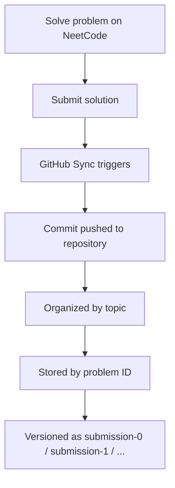
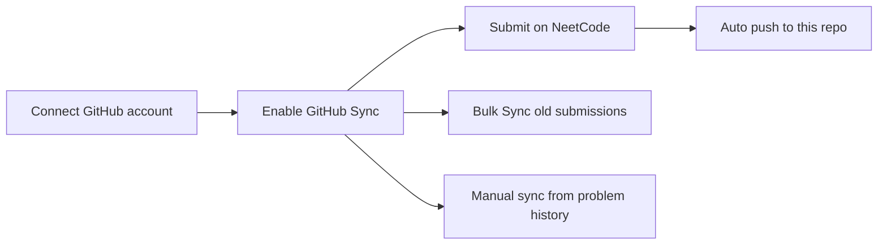
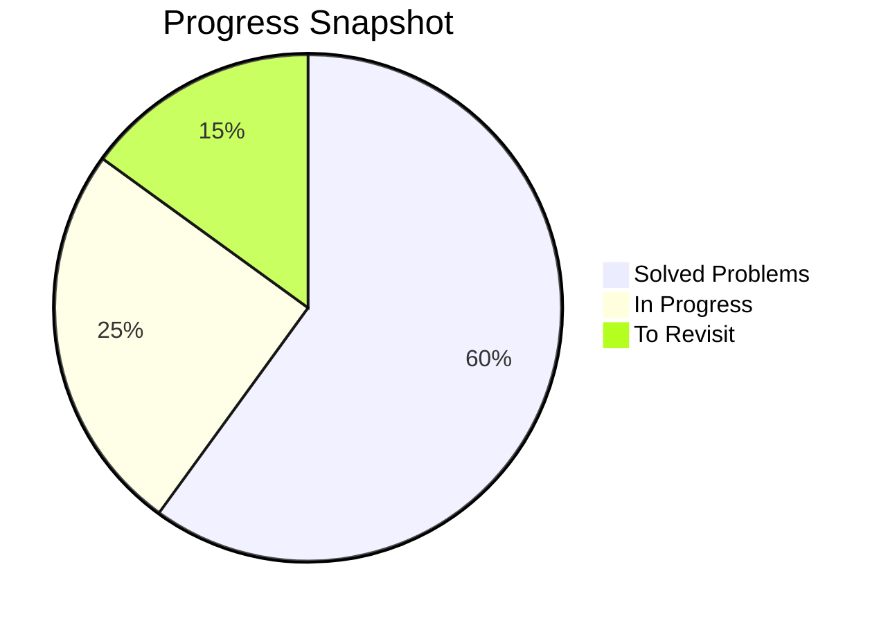
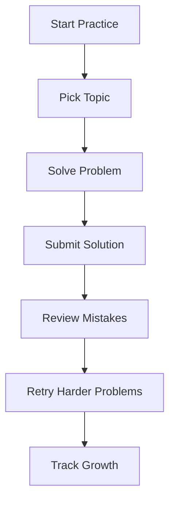

<div align="center">

# ✨ NeetCode Submissions
### <a href="https://github.com/AyushSingh360">@AyushSingh360</a>

<p>
  A clean, visual, and structured archive of coding problem solutions synced from
  <a href="https://neetcode.io">NeetCode.io</a>.
</p>

<p>
  
  
  
</p>

</div>

---

## Overview

This repository stores problem submissions synced from [NeetCode.io](https://neetcode.io/).  
Every submission can be automatically pushed here, making the repo a living tracker of progress, practice, and consistency.

---

## Visual Workflow



---

## Sync Flow



---

## Repository Structure

Solutions are organized by **topic** and then by **problem slug / ID**.  
Each attempt is stored separately so progress stays versioned and easy to review.

```bash
<topic-folder>/
└── <problem-id>/
    ├── submission-0.<ext>
    ├── submission-1.<ext>
    └── ...
```

### Example

```bash
Data Structures & Algorithms/two-integer-sum/submission-0.py
Data Structures & Algorithms/binary-search/submission-0.ts
Python For Beginners/python-hello-world/submission-0.py
```

---

## GitHub Sync Process

1. Connect your GitHub account at [neetcode.io/profile/github](https://neetcode.io/profile/github)
2. Enable sync preferences for submissions
3. Submit solutions on NeetCode
4. Let the platform auto-commit them into this repository
5. Use bulk sync to backfill older submissions
6. Use manual sync from problem history when needed

---

## Progress Snapshot

> You can update these values manually later for a more personalized dashboard.



---

## Practice Journey



---

## Supported Languages

| Language | Extension |
|---|---|
| Python | `.py` |
| JavaScript | `.js` |
| TypeScript | `.ts` |
| Java | `.java` |
| C++ | `.cpp` |
| C# | `.cs` |

---

## Why This Repo Exists

- Track coding interview preparation in one place
- Maintain a versioned history of submissions
- Review topic-wise progress over time
- Build a public proof-of-work portfolio
- Keep solutions organized and searchable

---

## Highlights

- Automatic GitHub sync from NeetCode
- Clean topic-wise folder organization
- Separate files for multiple submissions
- Easy review of older attempts
- Great for consistency tracking and interview prep

---

## Suggested Folder Experience

For an even cleaner repo, you can gradually add:

- Topic badges in folder READMEs
- Difficulty tags for problems
- A solved-count tracker
- Language usage stats
- Monthly progress graphs

---

## Tech Stack

<p>
  
</p>

---

## Profile Note

This repository reflects ongoing problem-solving practice through NeetCode’s sync system.  
It functions as both a submission archive and a visual journey of growth in data structures, algorithms, and interview preparation.

---

<div align="center">

### ⭐ Keep building. Keep solving. Keep shipping.

</div>
